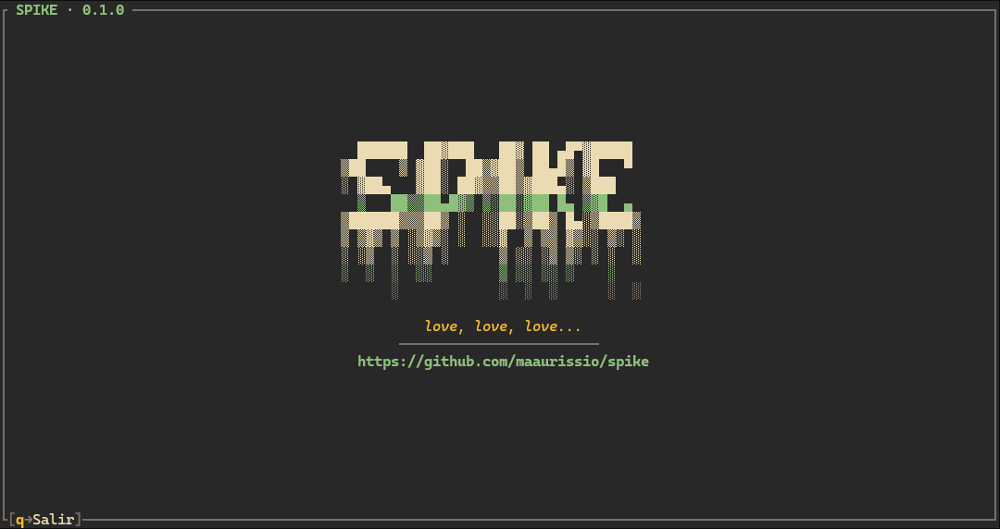
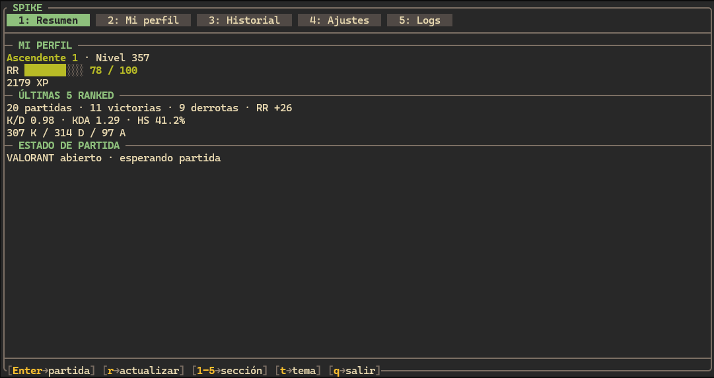
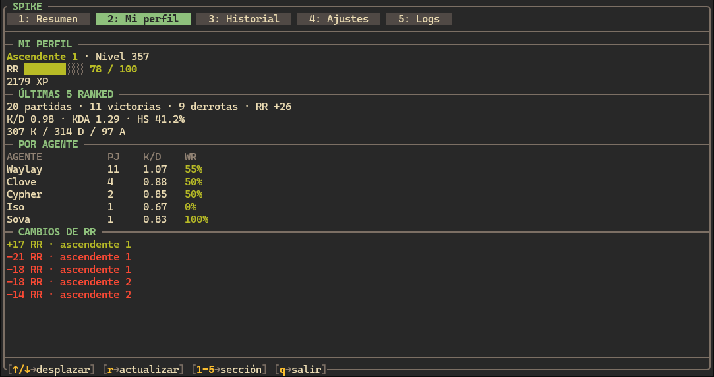
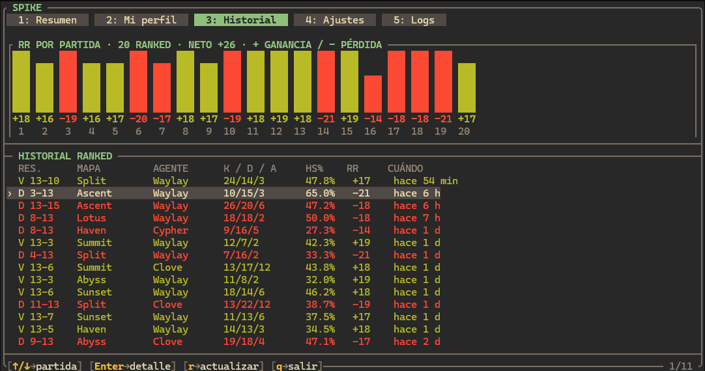
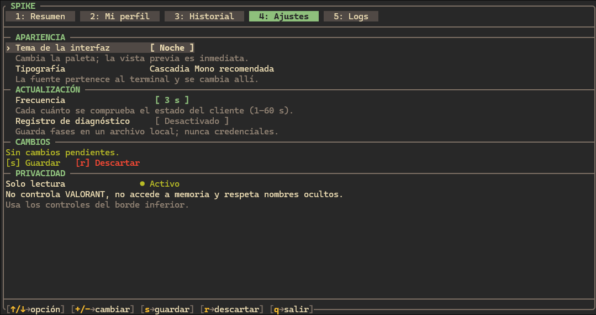
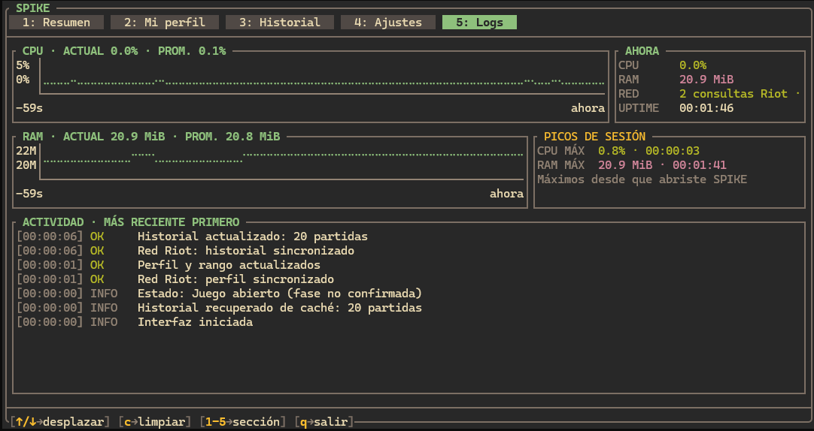
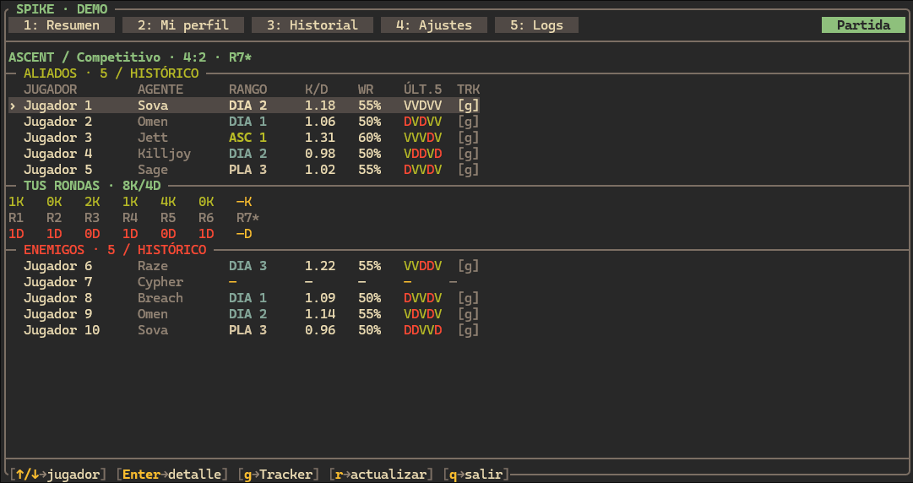

---------

Spike es una aplicación de terminal para VALORANT creada con Rust, Ratatui y Crossterm. Reúne el contexto disponible de la partida, progreso competitivo, historial Ranked y métricas locales en una interfaz rápida y navegable con teclado, creada para consumir el menor rendimiento posible.

> [!NOTE]
> Spike está en desarrollo constante, sin versión estable oficial aún.

---------

# Vista previa

> [!NOTE]
> Las siguientes capturas fueron generadas con `spike dashboard --demo` y usan el tema [Gruvbox](https://github.com/morhetz/gruvbox).

<table>
  <tr>
    <td></td>
    <td></td>
  </tr>
  <tr>
    <td></td>
    <td></td>
  </tr>
  <tr>
    <td></td>
    <td></td>
  </tr>
</table>

La demo funciona sin abrir VALORANT y permite recorrer la interfaz con datos ficticios:

```powershell
cargo run -- dashboard --demo
```

---------

## Qué hace

- Muestra un resumen de perfil, rango y progreso de RR.
- Consulta hasta 20 partidas Ranked propias y representa las ganancias y pérdidas de RR con un gráfico de barras.
- Presenta el detalle postpartida disponible, incluida la información propia por ronda cuando la fuente la entrega.
- Habilita la vista contextual **Partida** durante selección de agente, partida o postpartida.
- Muestra el roster disponible de aliados y enemigos, sus rangos y estadísticas cuando la fuente lo permite.
- Incluye **Logs** con CPU, RAM, uptime, picos de consumo y actividad sanitizada de la sesión.
- Ofrece un perfil opcional de Windows Terminal con tema Gruvbox y Fira Mono.

> [!IMPORTANT]
> El objetivo principal de Spike es presentar el roster de la partida actual —aliados y enemigos en modos 5v5— junto con los datos disponibles y permitidos. El perfil, historial y postpartida lo complementan.

---------

## Instalación

Por ahora Spike se ejecuta desde el código fuente en Windows.

### Requisitos

- Windows 10 u 11.
- [Rust](https://www.rust-lang.org/tools/install) estable con Cargo.
- VALORANT y Riot Client para consultar datos locales reales.
- Windows Terminal es opcional, pero recomendado para la experiencia visual.

```powershell
git clone https://github.com/maaurissio/Spike.git
Set-Location Spike
cargo run
```

Para una compilación optimizada:

```powershell
cargo build --release
.\target\release\spike.exe
```

> [!WARNING]
> Aún no hay instalador ni binarios oficiales para usuarios finales. Compila el proyecto solo si quieres probar la versión de desarrollo.

---------

## Uso

| Comando | Descripción |
|---|---|
| `spike` | Abre el dashboard. |
| `spike dashboard --demo` | Abre la demo local con datos ficticios. |
| `spike watch --once` | Comprueba el estado local una vez. |
| `spike player` | Muestra el perfil competitivo propio disponible. |
| `spike history --limit 1..20` | Consulta el historial Ranked propio. |
| `spike stats --limit 1..5` | Resume estadísticas propias recientes. |
| `spike doctor` | Ejecuta diagnósticos locales sin exponer secretos. |

Dentro de la interfaz, las teclas `1` a `5` cambian entre las vistas persistentes. Cuando hay una partida activa, aparece un acceso contextual a **Partida** en la parte superior derecha.

## Tema de Windows Terminal

Spike puede instalar un perfil separado de Windows Terminal, sin modificar los demás perfiles:

```powershell
cargo run -- terminal install
cargo run -- terminal launch
```

Para comprobarlo o quitarlo:

```powershell
cargo run -- terminal status
cargo run -- terminal uninstall
```

## Privacidad, datos y límites

Spike funciona en modo de solo lectura: no lee memoria del juego, no inyecta código, no automatiza controles y no guarda credenciales de sesión.

> [!CAUTION]
> La disponibilidad técnica de datos locales no equivale a autorización para distribuirlos. Antes de un lanzamiento estable se deben validar términos, consentimiento, privacidad y las fuentes utilizadas. Las identidades ocultas y los datos no disponibles se respetan: Spike no intenta inferirlos ni inventarlos.

## Desarrollo

```powershell
cargo fmt --all -- --check
cargo test
cargo clippy --all-targets --all-features -- -D warnings
```

---------

## Licencia

Distribuido bajo la [licencia MIT](LICENSE).

Spike no está afiliado con Riot Games. VALORANT y Riot Games son marcas registradas de Riot Games, Inc.
